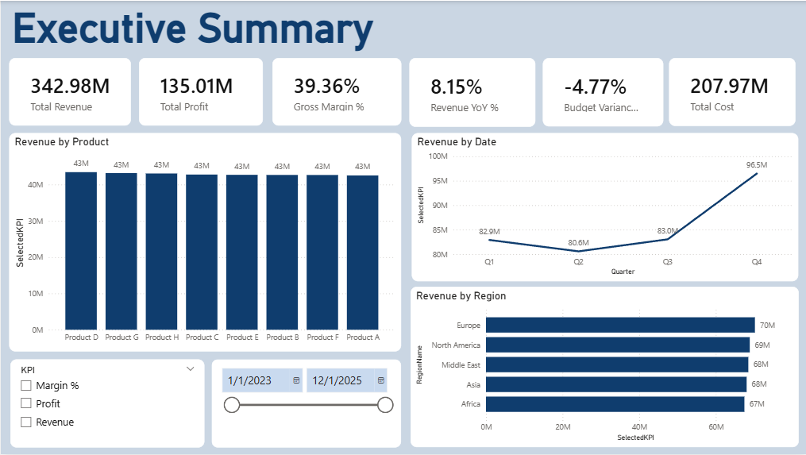
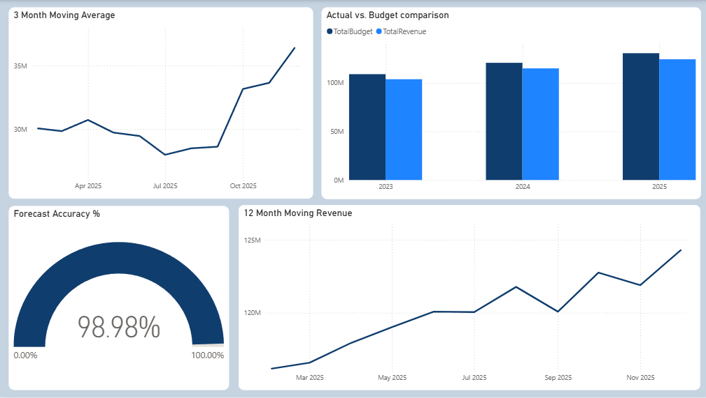
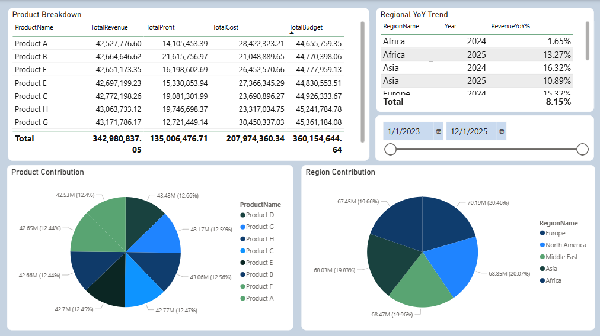
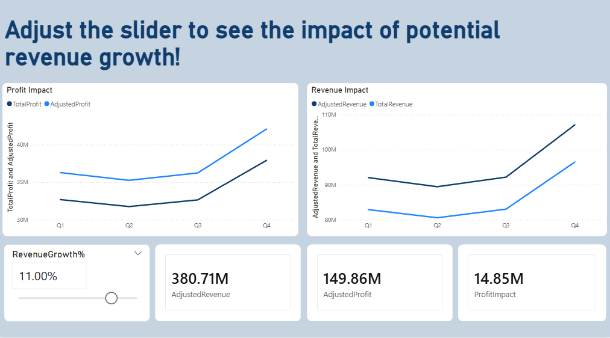

# Executive Financial Control Tower – Power BI Project

##  Project Overview
 This is a project I made to showcase my Power BI skills. It delivers an executive-level **Financial Control Tower dashboard**.

This dashboard enables leadership to monitor financial performance, compare Actual vs Budget, track forecast accuracy, analyze regional and product performance, and simulate revenue growth scenarios, all within a secure and enterprise-grade BI framework.

In this project, I wanted to demonstrate my DAX skills with 25+ DAX measures and Time Intelligence implemented. 

I recommend downloading the PBIX file to see all dashboard capabilities, but you can also scroll down to see screenshots.

Please note I only have access to Power BI desktop, therefore I am not able to implement features like buttons etc.

---

##  Project Objectives
The dashboard enables executives (CFO-level audience) to:

- Monitor Revenue, Cost, Profit, and Gross Margin
- Compare Actual vs Budget
- Track Forecast Accuracy
- Analyze Regional and Product Performance
- Perform Time-Based Analysis (YTD, YoY, Rolling 12 Months)
- Simulate Revenue Growth Scenarios (What-if Analysis)
- Secure data access using Row-Level Security (RLS)

---

## Report Preview

### Page 1 – Executive Overview 
- KPI Cards (Revenue, Profit, Margin, YoY %, Budget Variance %)
- Monthly Revenue Trend
- Revenue by Region
- Dynamic KPI Toggle
- Dynamic Titles
  
  

---

### Page 2 – Budget Analysis
- Rolling 12-Month Trend
- Budget vs Actual Comparison
- Forecast Accuracy Visualization
- Drill-down Capability
  
  

---

### Page 3 – Region & Product Breakdown
- Product Breakdown
- Regional YoY Trend
- Margin Analysis
- Contribution Analysis

---

### Page 4 – Scenario Planning
- What-if Slider 
- Adjusted Revenue vs Actual
- Profit Sensitivity Visualization

##  DAX Implementation (25+ Measures)

### Core Financial Measures
- Total Revenue  
- Total Cost  
- Total Profit  
- Gross Margin %  
- Total Budget  
- Total Forecast  
- Budget Variance  
- Budget Variance %  
- Forecast Accuracy %  

### Time Intelligence
Implemented using:
`TOTALYTD`, `SAMEPERIODLASTYEAR`, `DATEADD`, `DATESINPERIOD`

Measures include:
- Revenue YTD  
- Revenue Previous Year  
- Revenue YoY %  
- Rolling 12 Months Revenue  
- 3-Month Moving Average  
- YTD Profit  

### Contribution & Ranking
- Revenue Contribution % by Region  
- Revenue Contribution % by Product  

### Dynamic KPI Selector
- Disconnected KPI Table  
- Toggle between Revenue / Profit / Margin %  
- Implemented using `SWITCH()` and `SELECTEDVALUE()`  

### What-If Scenario Planning
- Revenue Growth % parameter  
- Adjusted Revenue  
- Adjusted Profit  
- Profit Impact analysis  

---

##  Row-Level Security (RLS)

Implemented role-based access control:

**Role: Region Manager**
- Users can only view data for their assigned region
- Tested using “View as Role” functionality

---

##  Business Value

This solution provides leadership with:

- Real-time financial performance visibility
- Improved budget control
- Better forecasting insight
- Scenario-based strategic planning
- Secure, role-based data access
- Data-driven executive decision support

  ---

